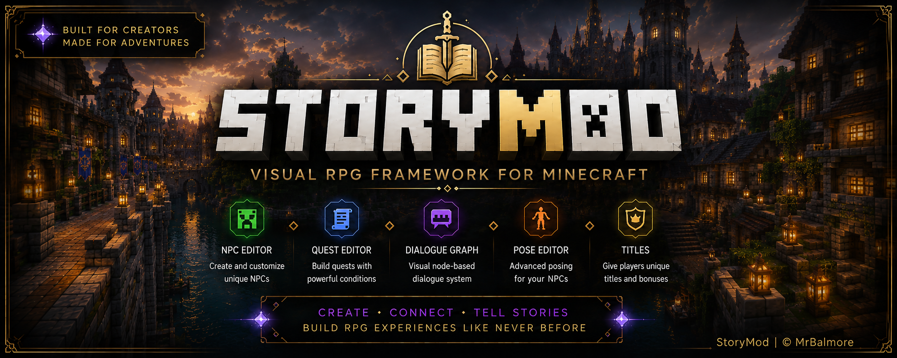
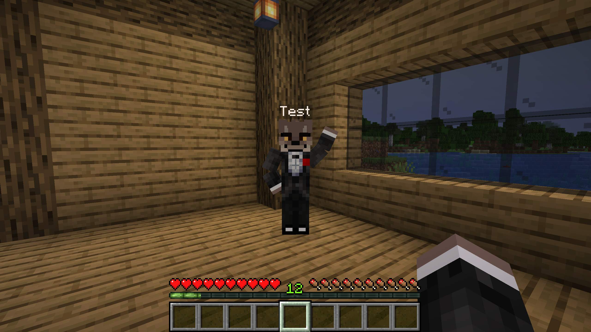
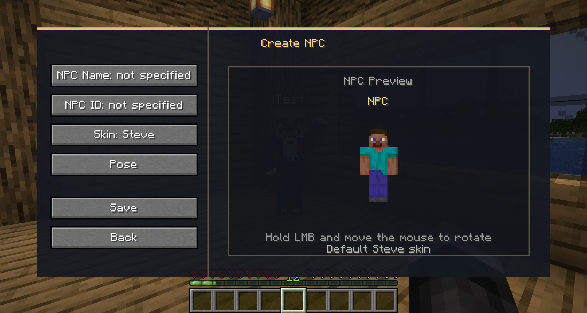
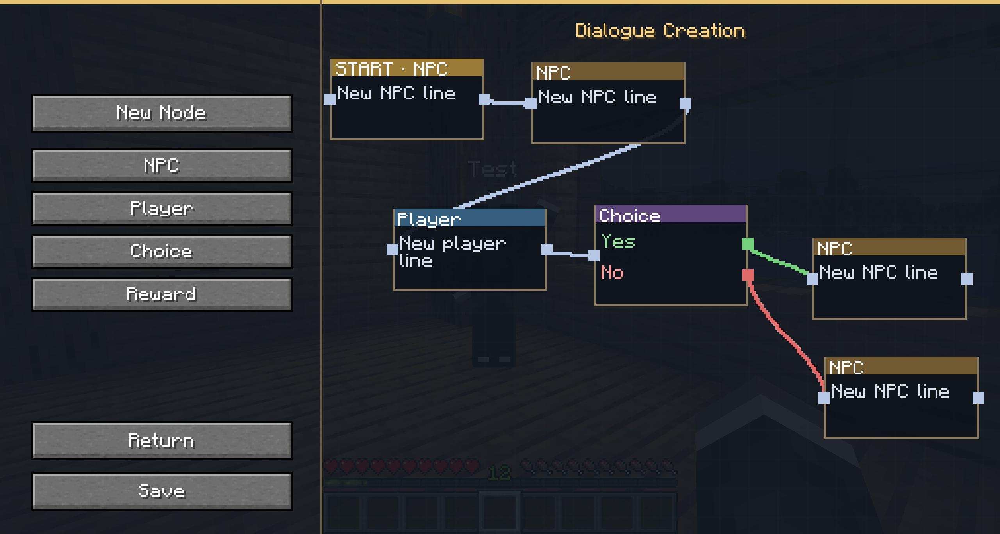
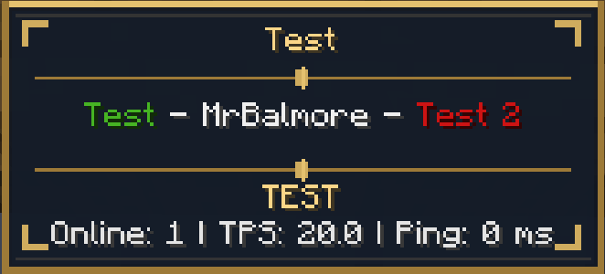
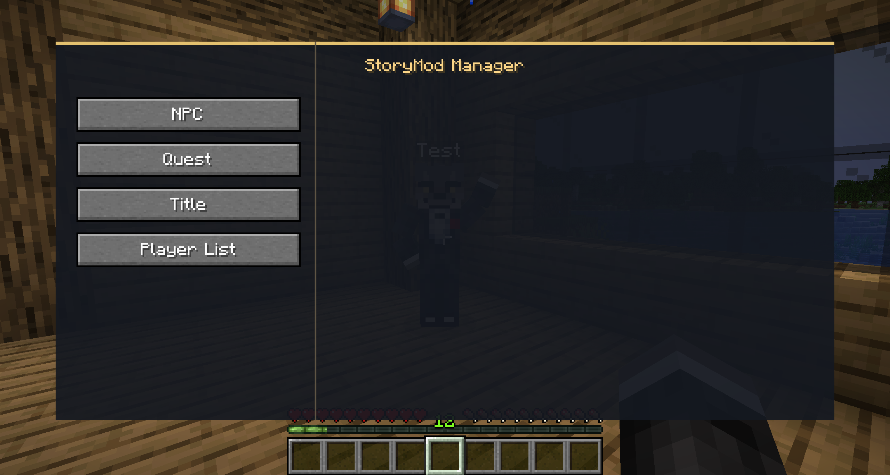
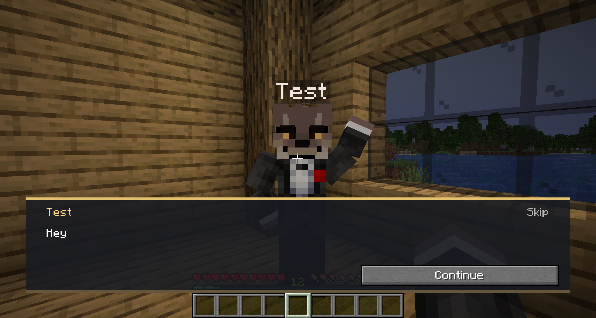

  

<h1 align="center">StoryMod</h1>

  Visual RPG Framework for Minecraft 1.21.1

  <strong>Designed by MrBalmore</strong>

---

## About StoryMod

StoryMod is a visual framework for creating RPG content directly inside Minecraft.

The project is designed for game designers and server creators who want to build quests, NPCs, branching dialogues and other gameplay systems without manually editing configuration files.

StoryMod is currently presented as a portfolio project. Source code and compiled files are not publicly available.

If you are interested in the mod and would like to purchase it: mrbalmore228@gmail.com

---

## Key Features

### NPC Editor

- Create, edit and remove native NPCs
- Custom names, IDs and Minecraft skins
- Live 3D character preview
- Custom pose editor
- Integration with Emotes animations (beta)
  

### Quest Editor

- Visual quest creation workflow
- Multi-stage quest structure
- NPC interactions
- Objectives, requirements and rewards
- Repeatable and one-time quests

### Dialogue Graph Editor

- Node-based dialogue creation
- Branching conversations
- Player choices
- Positive and negative dialogue paths
- Start nodes and connected dialogue sequences
- Reward nodes

### Pose Editor

- Custom NPC poses
- Individual body-part controls
- Height adjustment
- Live character preview
- Saved poses for persistent NPCs

### Title System and Player List

- Left and right player titles
- Title creation, editing and removal
- Custom title colours
- Assign and remove titles through the interface
- Custom upper and lower TAB text
- Server-side configuration

---

## Screenshots

---

## Project Information

- Minecraft: 1.21.1
- Mod Loader: NeoForge
- Version: 1.0.0
- Languages: English, German and Russian
- Project Status: Active development

---

## My Role

I designed StoryMod as a Technical Game Design and Gameplay Systems project.

My responsibilities include:

- Game-system design
- Quest-system design
- Dialogue-flow design
- Tool and editor UX
- NPC workflow design
- Feature specification
- Testing and iterative improvement
- Coordination of technical implementation

---

## Portfolio Focus

StoryMod demonstrates experience in:

- Technical Game Design
- Gameplay Systems Design
- Quest Design
- Tool Design
- UX for internal game-development tools
- Visual scripting and node-based workflows
- Iterative testing and feature refinement

---

## Roadmap

- [x] Native NPC system
- [x] NPC editor
- [x] Quest editor
- [x] Dialogue graph editor
- [x] Pose editor
- [x] Title system
- [x] Player-list editor
- [x] English, German and Russian localization
- [ ] Improved quest and dialogue conditions
- [ ] Additional editor polish

---

## Author

**MrBalmore**  
Technical Game Designer  
Germany
